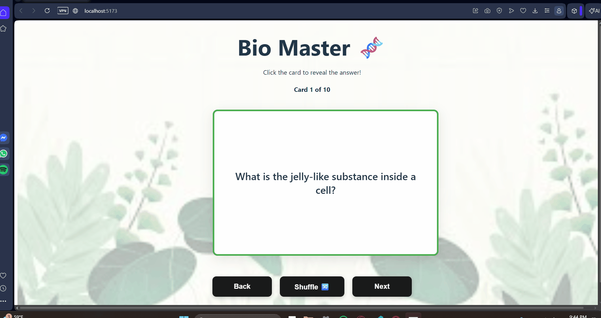

Web Development Project 2 - Bio Master 🧬
Submitted by: Duban Correa

This web app is a study aid designed to help users learn essential Biology concepts through an interactive flashcard interface.

Time spent: 5 hours spent in total

User Stories
The following required functionality is completed:

[x] The app displays the title of the card set, a short description, and the total number of cards

[x] A single card at a time is displayed

[x] A list of card pairs is created (10 essential Biology pairs)

[x] Clicking on the card flips it over, showing the corresponding information

[x] Clicking on a flipped card again flips it back to the front

[x] Clicking on the Next button displays a new card from the set

The following stretch features are implemented:

[x] Cards have different visual styles (color borders) based on their category: Easy, Medium, and Hard

[x] Shuffle functionality to randomize the card order

[x] Start Screen to welcome the user before the study session begins

[x] Previous Button to allow users to navigate backward through the cards

The following additional features are implemented:

[x] Full 3D CSS flip animation for a realistic flashcard feel

[x] Custom plant-themed background with a readability overlay

Video Walkthrough
Here's a walkthrough of implemented user stories:

Notes
One of the main challenges was ensuring the 3D flip animation didn't interfere with the button spacing. By using a perspective container and specific margins, I was able to keep the UI clean and functional.

License
Copyright [2026] [Duban Correa]

Licensed under the Apache License, Version 2.0 (the "License");
you may not use this file except in compliance with the License.
You may obtain a copy of the License at

    [http://www.apache.org/licenses/LICENSE-2.0](http://www.apache.org/licenses/LICENSE-2.0)

Unless required by applicable law or agreed to in writing, software
distributed under the License is distributed on an "AS IS" BASIS,
WITHOUT WARRANTIES OR CONDITIONS OF ANY KIND, either express or implied.
See the License for the specific language governing permissions and
limitations under the License.